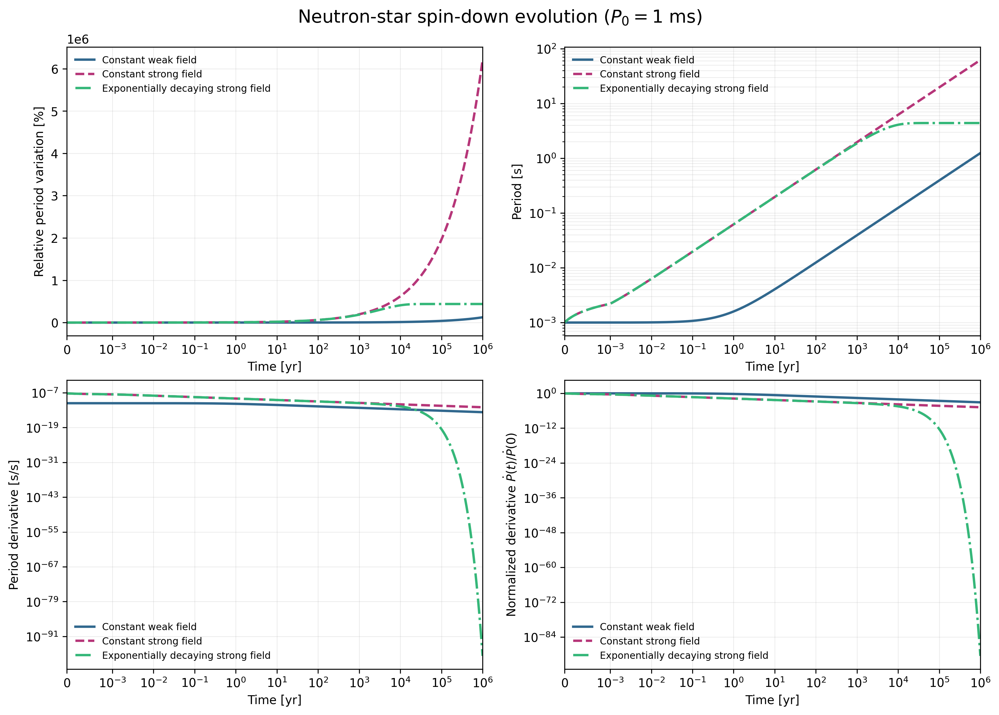
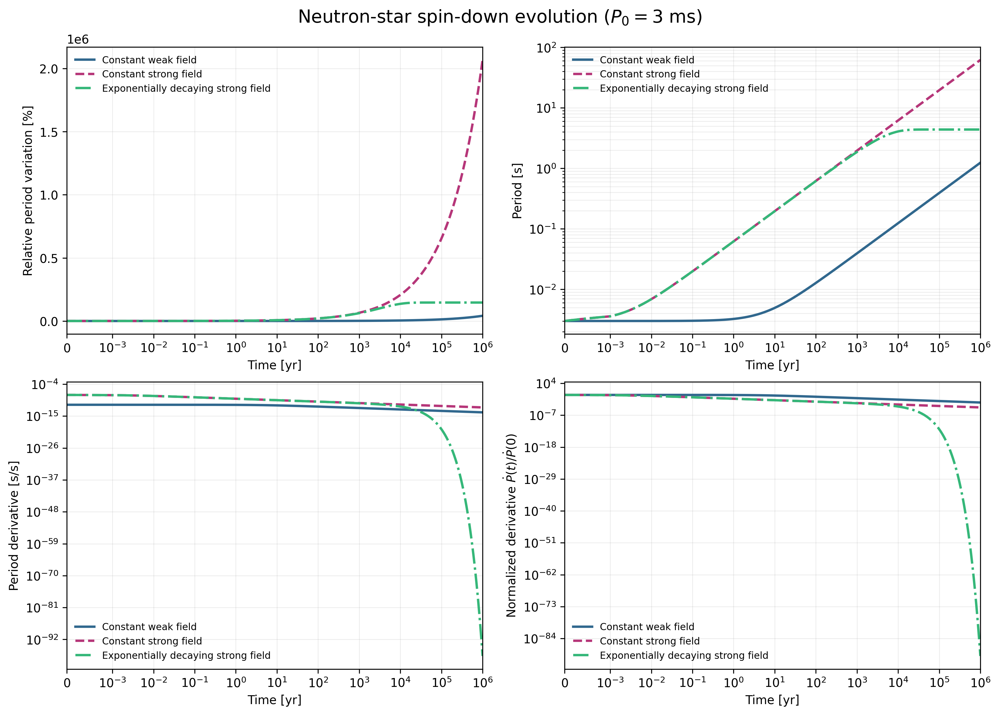
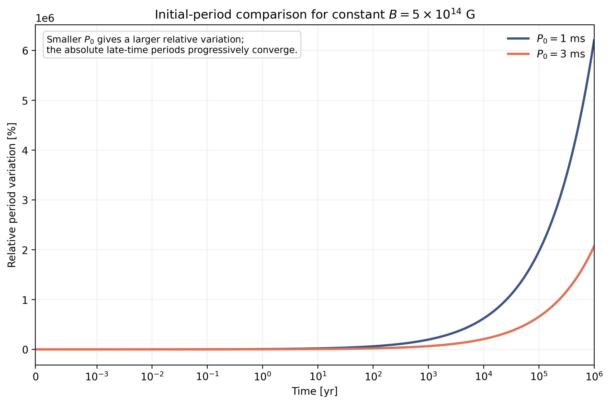
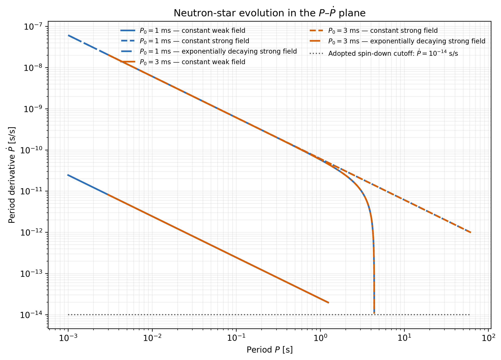

# Neutron-Star Spin-Down Evolution

[](LICENSE)
[](src/neutron_star_spin_down.py)
[](src/neutron_star_spin_down.wl)
[](requirements.txt)

## 🌀 Project overview

This project studies the rotational evolution of an isolated neutron star under magnetic-dipole braking. The analysis compares three dipolar magnetic-field prescriptions:

- a constant weak field, $B_{\mathrm d}=10^{13}\,\mathrm{G}$;
- a constant strong field, $B_{\mathrm d}=5\times10^{14}\,\mathrm{G}$;
- an exponentially decaying strong field,
  $B_{\mathrm d}(t)=5\times10^{14}e^{-t/\tau}\,\mathrm{G}$, with
  $\tau=10^4\,\mathrm{yr}$.

The evolution is followed to $1\,\mathrm{Myr}$ for initial periods of $1\,\mathrm{ms}$ and $3\,\mathrm{ms}$.

## 📄 Project report

The **[complete original course-project report](report/neutron_star_spin_down_report.pdf)** is included in PDF format. The report is preserved as the submitted project document; it was not regenerated from the public source code.

## Key features

- Analytical spin-down solutions for constant and exponentially decaying magnetic fields
- Evolution of period, period derivative, angular velocity, and relative period variation
- Evolutionary tracks in the $P$-$\dot P$ diagram
- Newtonian centrifugal-breakup estimate
- Clean Wolfram Language source
- Reproducible Python implementation using NumPy and Matplotlib
- Numerical consistency checks for positivity, monotonicity, finite values, initial conditions, and the decaying-field asymptote
- Automatic generation of the four public PNG figures

## 🧲 Physical model

The spin-down law is

$$
P\dot P = K B_{\mathrm d}^{2}(t),
$$

with

$$
K=2.44\times10^{-40}\ \mathrm{s\,G^{-2}}.
$$

For a constant dipolar field,

$$
P(t)=\sqrt{P_0^2+2KB_{\mathrm d}^2t},
$$

$$
\dot P(t)=\frac{KB_{\mathrm d}^2}{P(t)}.
$$

For an exponentially decaying field,

$$
B_{\mathrm d}(t)=B_0e^{-t/\tau},
$$

$$
P(t)=
\sqrt{
P_0^2+
KB_0^2\tau
\left(1-e^{-2t/\tau}\right)
},
$$

$$
\dot P(t)=
\frac{KB_0^2e^{-2t/\tau}}{P(t)}.
$$

The angular velocity and asymptotic period are

$$
\Omega(t)=\frac{2\pi}{P(t)},
$$

$$
P_\infty=\sqrt{P_0^2+KB_0^2\tau}.
$$

All calculations use CGS units internally.

## Model parameters

| Parameter | Value |
| --- | --- |
| Weak dipolar field | $10^{13}\,\mathrm{G}$ |
| Strong dipolar field | $5\times10^{14}\,\mathrm{G}$ |
| Decay timescale | $10^4\,\mathrm{yr}$ |
| Initial periods | $1\,\mathrm{ms}$, $3\,\mathrm{ms}$ |
| Evolution time | $1\,\mathrm{Myr}$ |
| Stellar radius | $10^6\,\mathrm{cm}$ |
| Moment of inertia | $10^{45}\,\mathrm{g\,cm^2}$ |
| Adopted $P$-$\dot P$ cutoff | $10^{-14}\,\mathrm{s\,s^{-1}}$ |

## Repository structure

```text
.
├── README.md
├── LICENSE
├── requirements.txt
├── report/
│   └── neutron_star_spin_down_report.pdf
├── src/
│   ├── neutron_star_spin_down.py
│   └── neutron_star_spin_down.wl
└── plots/
    ├── spin_evolution_1ms.png
    ├── spin_evolution_3ms.png
    ├── initial_period_comparison.png
    └── p_pdot_diagram.png
```

## Numerical setup

Python 3.10 or newer is required.

```bash
python3 -m venv .venv
source .venv/bin/activate
python -m pip install --upgrade pip
python -m pip install -r requirements.txt
```

## 🔬 Reproducing the analysis

Run the Python implementation from the repository root:

```bash
python src/neutron_star_spin_down.py
```

The output directory can also be given explicitly:

```bash
python src/neutron_star_spin_down.py --output-dir plots
```

The script validates the analytical model numerically, prints the main derived quantities, and regenerates the four PNG figures. The Python implementation was executed and validated on Linux.

The equivalent Wolfram Language implementation is intended for:

```bash
wolframscript -file src/neutron_star_spin_down.wl
```

It reproduces the same corrected physical model and was statically reviewed. It was not executed in the current environment because WolframScript was unavailable.

## Numerical results

| Quantity | $P_0=1\,\mathrm{ms}$ | $P_0=3\,\mathrm{ms}$ |
| --- | ---: | ---: |
| $P(1\,\mathrm{Myr})$, constant $10^{13}\,\mathrm{G}$ | $1.240972\,\mathrm{s}$ | $1.240975\,\mathrm{s}$ |
| $P(1\,\mathrm{Myr})$, constant $5\times10^{14}\,\mathrm{G}$ | $62.048587\,\mathrm{s}$ | $62.048587\,\mathrm{s}$ |
| $P_\infty$, decaying $5\times10^{14}\,\mathrm{G}$ | $4.387498\,\mathrm{s}$ | $4.387499\,\mathrm{s}$ |

The adopted stellar parameters give the Newtonian centrifugal-breakup estimates

$$
\Omega_{\mathrm{breakup}}
\simeq 1.2916\times10^4\ \mathrm{rad\,s^{-1}},
$$

$$
P_{\mathrm{breakup}}
\simeq 0.4865\ \mathrm{ms}.
$$

Both adopted initial periods are above this estimated breakup period.

## Physical interpretation

- The stronger constant magnetic field produces much faster spin-down.
- For a constant field, the period continues growing as $t^{1/2}$ at late times.
- Magnetic-field decay causes the period to approach a finite asymptote while $\dot P$ tends to zero.
- The smaller initial period produces a larger relative percentage variation because the change is normalized by $P_0$.
- At late times, the absolute constant-field evolution becomes nearly independent of the initial period.

## 🖼️ Figures

| Spin evolution from $P_0=1\,\mathrm{ms}$ |
|:---:|
| <br><em>Period evolution and derived spin-down quantities for the three magnetic-field prescriptions.</em> |

| Spin evolution from $P_0=3\,\mathrm{ms}$ |
|:---:|
| <br><em>The same comparison for the longer initial period.</em> |

| Initial-period comparison | $P$-$\dot P$ evolutionary tracks |
|:---:|:---:|
| <br><em>Relative variation under the constant strong field.</em> | <br><em>Six physical evolutionary tracks on logarithmic axes.</em> |

The horizontal reference line in the $P$-$\dot P$ diagram marks the adopted spin-down cutoff,

$$
\dot P=10^{-14}\ \mathrm{s\,s^{-1}}.
$$

## Implementation note

The public source is a cleaned and validated reconstruction of the original Mathematica workflow. It uses explicit units, removes duplicated calculation blocks, derives output paths from the repository location, and evaluates the physically consistent analytical expressions.

## License

This repository is released under the [MIT License](LICENSE). © 2026 Federico Malara.
