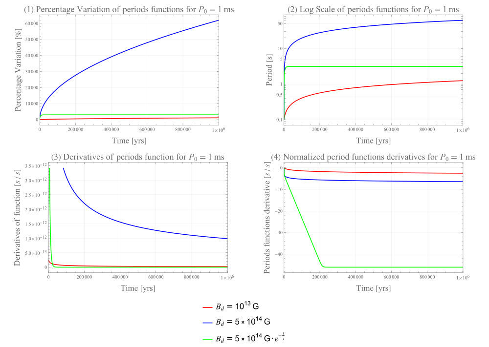
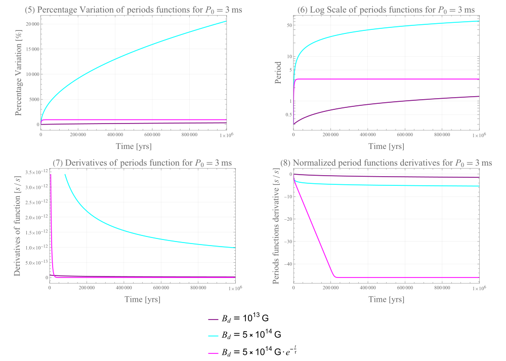
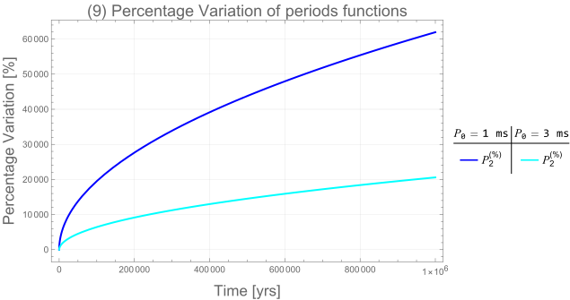
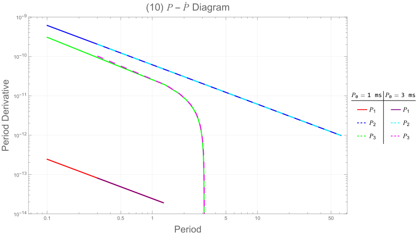

# Neutron-Star Spin-Down Evolution

[](LICENSE)
[](src/neutron_star_spin_down.wl)

> **Course project / homework** — *Neutron Stars, Black Holes & Gravitational Waves*, Universitat Autònoma de Barcelona (UAB)

## 🌀 Project overview

Developed during the course *Neutron Stars, Black Holes & Gravitational Waves* at the Universitat Autònoma de Barcelona, this project studies the rotational evolution of an isolated neutron star under magnetic-dipole braking. The analysis compares three dipolar magnetic-field prescriptions:

- a constant weak field, $B_{\mathrm d}=10^{13}\mathrm{G}$;
- a constant strong field, $B_{\mathrm d}=5\times10^{14}\mathrm{G}$;
- an exponentially decaying strong field,
  $B_{\mathrm d}(t)=5\times10^{14}e^{-t/\tau}\mathrm{G}$, with
  $\tau=10^4\mathrm{yr}$.

The evolution is followed to $1\mathrm{Myr}$ for initial periods of $1\mathrm{ms}$ and $3\mathrm{ms}$.

## 📄 Project report

The **[complete original course-project report](report/neutron_star_spin_down_report.pdf)** is included in PDF format.

## Key features

- Analytical spin-down solutions for constant and exponentially decaying magnetic fields
- Evolution of period, period derivative, angular velocity, and relative period variation
- Evolutionary tracks in the $P$-$\dot{P}$ diagram
- Newtonian centrifugal-breakup estimate
- Clean Wolfram Language source
- Numerical consistency checks for positivity, monotonicity, finite values, initial conditions, and the decaying-field asymptote
- Original Mathematica figures used in the project report, preserved as SVG files

## 🧲 Physical model

The spin-down law is

$$
P\dot{P} = K B_{\mathrm d}^{2}(t),
$$

with

$$
K=2.44\times10^{-40}\ \mathrm{s}\ \mathrm{G}^{-2}.
$$

For a constant dipolar field,

$$
P(t)=\sqrt{P_0^2+2KB_{\mathrm d}^2t},
$$

$$
\dot{P}(t)=\frac{KB_{\mathrm d}^2}{P(t)}.
$$

For an exponentially decaying field,

$$
B_{\mathrm d}(t)=B_0e^{-t/\tau},
$$

$$
P(t)=
\sqrt{
P_0^2+
KB_0^2\tau
\left(1-e^{-2t/\tau}\right)
},
$$

$$
\dot{P}(t)=
\frac{KB_0^2e^{-2t/\tau}}{P(t)}.
$$

The angular velocity and asymptotic period are

$$
\Omega(t)=\frac{2\pi}{P(t)},
$$

$$
P_\infty=\sqrt{P_0^2+KB_0^2\tau}.
$$

All calculations use CGS units internally.

## Model parameters

| Parameter | Value |
| --- | --- |
| Weak dipolar field | $10^{13}\ \mathrm{G}$ |
| Strong dipolar field | $5\times10^{14}\ \mathrm{G}$ |
| Decay timescale | $10^4\ \mathrm{yr}$ |
| Initial periods | $1\ \mathrm{ms}$, $3\ \mathrm{ms}$ |
| Evolution time | $1\ \mathrm{Myr}$ |
| Stellar radius | $10^6\ \mathrm{cm}$ |
| Moment of inertia | $10^{45}\ \mathrm{g}\ \mathrm{cm^2}$ |
| Adopted $P$-$\dot{P}$ cutoff | $10^{-14}\ \mathrm{s}\ \mathrm{s}^{-1}$ |

## Repository structure

```text
.
├── README.md
├── LICENSE
├── report/
│   └── neutron_star_spin_down_report.pdf
├── src/
│   └── neutron_star_spin_down.wl
└── plots/
    ├── Final1.svg
    ├── Final2.svg
    ├── 4th_question.svg
    └── ppdot.svg
```

## 🔬 Wolfram Language source

The analytical model is provided as a Wolfram Language script and can be evaluated with WolframScript from the repository root:

```bash
wolframscript -file src/neutron_star_spin_down.wl
```

The source implements the physically consistent analytical model and was statically reviewed. It was not executed in the current environment because WolframScript was unavailable. The SVG figures below are the original Mathematica exports used in the project report and are preserved independently of the cleaned source.

## Numerical results

| Quantity | $P_0=1\ \mathrm{ms}$ | $P_0=3\ \mathrm{ms}$ |
| --- | ---: | ---: |
| $P(1\ \mathrm{Myr})$, constant $10^{13}\ \mathrm{G}$ | $1.240972\ \mathrm{s}$ | $1.240975\ \mathrm{s}$ |
| $P(1\ \mathrm{Myr})$, constant $5\times10^{14}\ \mathrm{G}$ | $62.048587\ \mathrm{s}$ | $62.048587\ \mathrm{s}$ |
| $P_\infty$, decaying $5\times10^{14}\ \mathrm{G}$ | $4.387498\ \mathrm{s}$ | $4.387499\ \mathrm{s}$ |

The adopted stellar parameters give the Newtonian centrifugal-breakup estimates

$$
\Omega_{\mathrm{breakup}}
\simeq 1.2916\times10^4\ \mathrm{rad}\cdot\mathrm{s}^{-1},
$$

$$
P_{\mathrm{breakup}}
\simeq 0.4865\ \mathrm{ms}.
$$

Both adopted initial periods are above this estimated breakup period.

## Physical interpretation

- The stronger constant magnetic field produces much faster spin-down.
- For a constant field, the period continues growing as $t^{1/2}$ at late times.
- Magnetic-field decay causes the period to approach a finite asymptote while $\dot{P}$ tends to zero.
- The smaller initial period produces a larger relative percentage variation because the change is normalized by $P_0$.
- At late times, the absolute constant-field evolution becomes nearly independent of the initial period.

## 🖼️ Figures

| Spin evolution from P<sub>0</sub> = 1 ms |
|:---:|
| <br><em>Percentage period variation, logarithmic period evolution, period derivatives, and normalized derivatives for the three magnetic-field prescriptions up to 1 Myr.</em> |

| Spin evolution from P<sub>0</sub> = 3 ms |
|:---:|
| <br><em>The corresponding four-panel evolution for an initial period of 3 ms.</em> |

| Initial-period comparison |
|:---:|
| <br><em>Percentage variation for P<sub>0</sub> = 1 ms and P<sub>0</sub> = 3 ms under the constant field B<sub>d</sub> = 5 × 10<sup>14</sup> G.</em> |

| P–Ṗ evolutionary tracks |
|:---:|
| <br><em>Evolutionary trajectories for all magnetic-field prescriptions and both initial periods.</em> |

The horizontal cutoff adopted for the $P$-$\dot{P}$ diagram is

$$
\dot{P}=10^{-14}\ \mathrm{s}\ \mathrm{s}^{-1}.
$$

## Implementation note

The public source is a cleaned reconstruction of the original Mathematica workflow. It uses explicit units, removes duplicated calculation blocks, derives output paths from the repository location, and evaluates the physically consistent analytical expressions. The figures are the original SVG assets included in the course-project report.

## License

This repository is released under the [MIT License](LICENSE). © 2026 Federico G. Malara.
